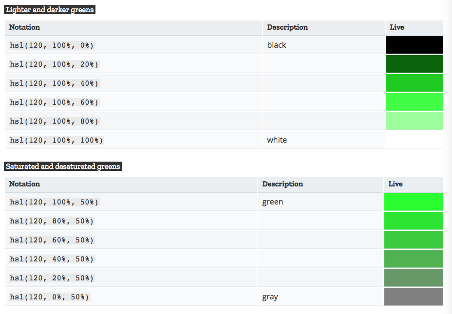
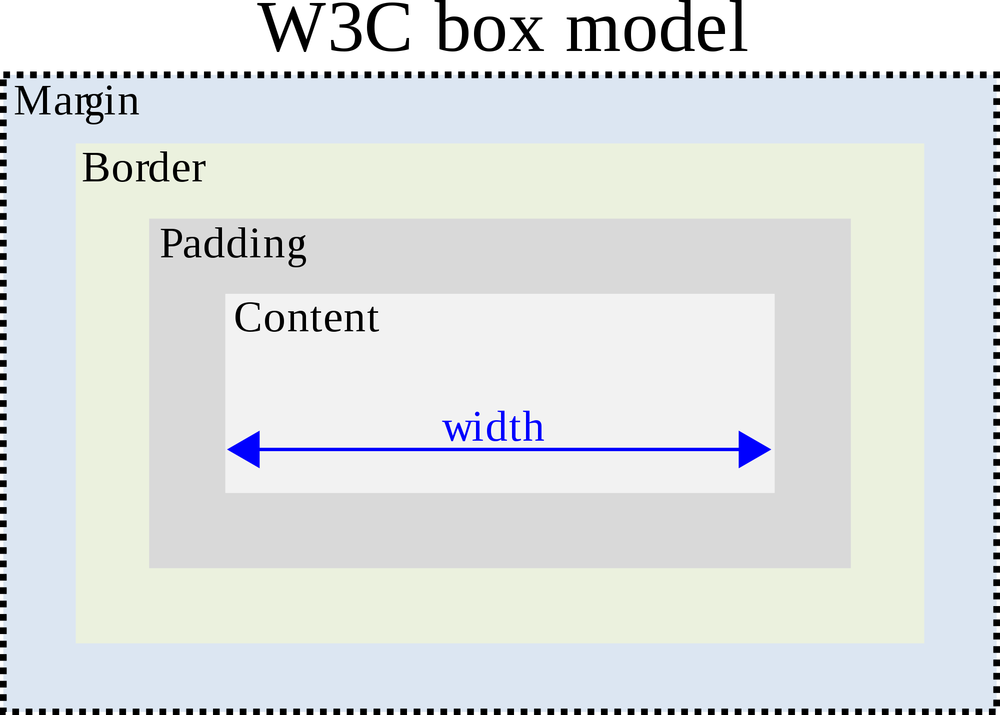
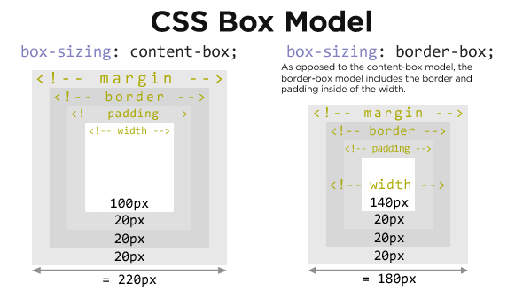
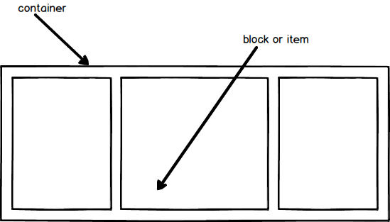

autoscale: true

# [fit] CSS basics

---

## History of CSS

* Proposed in 1995
* Håkon Wium Lie & Bert Bos created the proposal
* many different ideas from different browsers came together
* First browser to implement: Internet Explorer 3!

---

# CSS selectors

We can apply styles to a particular part of our HTML document using _selectors_.

* `h1` - selects all `h1` elements
* `h1, h2` - selects all `h1` and `h2` elements
* `.selfie` - selects all elements with the class "selfie"
* `.sidebar a` - selects all `a` elements nested inside elements with the class "sidebar"

---

# Types of selectors

* elements - `h1`
* classes - `.sidebar`
* ids - `#main-menu`
* attributes - `[lang=es]`
* pseudo-classes - `:hover, :required`
* pseudo-elements - `p::first-letter`
* combinations - `.sidebar a`, `ul > li`, `img + .caption`

---

# Exercise: CSS Diner

https://flukeout.github.io/

---

# Focus on using classes.

Each selector has a _specificity_, and they are hard to remember and work with well. [^1]

Pseudo-classes have some use as well, particularly `:hover`.

[^1]: [Specificity rules](https://developer.mozilla.org/en-US/docs/Learn/CSS/Introduction_to_CSS/Cascade_and_inheritance#Specificity)

---

# CSS properties

We use _properties_ to set the style of selected elements.

```css
.selfie {
  border-color: black;
  border-width: 1px;
  border-style: solid;
  padding: 3px;
}
```

Notice the semicolons at the end of each line.

---

# CSS syntax

```css
selector {
    property: value;
}
```

Always start with a selector, then curly braces. You can have multiple property-value pairs inside the braces. You cannot nest braces. [^2]

[^2]: We will see nested braces with responsive design later.

---

# Text and font properties

* color: the color of the text, by name or hex code
* font-size: the size of the text, in pixels (px) or other units
* font-family: the font used, multiples can be listed
* font-weight: normal, bold
* text-decoration: none, underline, overline, line-through, blink
* text-align: left, right, center, justify
* line-height: multiplier

---

# Colors

There is a giant list of color names you can use, but people generally use a _hex code_. A hex code is a set of three numbers between 0 and 255 in hexadecimal (base-16) format, beginning with a pound sign, like: `#FF00A7`.

The first number is the amount of red, the second the amount of green, and the third the amount of blue. `#000000` is black and `#FFFFFF` is white.

See [HTML Color Codes](http://htmlcolorcodes.com/).

---

# Other ways to describe colors

* rgb(decRed, decGreen, decBlue)
* rgba(decRed, decGreen, decBlue, alpha)
* hsl(hue, saturation, lightness)
* hsla(hue, saturation, lightness, alpha)

---



---

# Block properties

* background-color
* padding: space inside the box
* margin: space outside the box
* border-width: size of the border
* border-color: color of the border
* border-style: none, dotted, dashed, solid, double
* border-radius: round corners
* width: total width of box, in px, em, or percentage

---

# Box model



---

# margin and padding

You can specify the margin and padding in three ways:

* one margin for all sides
* one margin for the top and bottom and another for the sides
* one margin for each side in this order: top, right, bottom, left (clockwise)

---

```css
margin: 5px;                /* all */
margin: 5px 10px:           /* vertical, horizontal */
margin: 5px 10px 10px 20px; /* top, right, bottom, left */
```

---

# Property shorthand

We see this often with CSS properties, where one property defines many subproperties:[^3]

* border - border-width, border-color, border-style, border-top, border-left, border-right, border-bottom
* margin - margin-top, margin-bottom, margin-left, margin-right
* padding - padding-top, padding-bottom, padding-left, padding-right

[^3]: https://developer.mozilla.org/en-US/docs/Web/CSS/Shorthand_properties

---

# Units of measure

* px - pixels, an _absolute unit_
* em - relative to the font-size, 1em = 1 x font-size, additive
* rem - relative to the base font-size, not additive
* % - percentage, relative to enclosing element
* 0 - never needs a unit

---

# A box with rounded corners and a border

```css
.likes {
  background-color: blue;
  border-color: black;
  border-radius: 10px;
  border-style: solid;
  border-width: 1px;
  color: white;
  margin: 10px 0;
  padding: 5px 10px;
}
```

---

# box-sizing



---

# Down with content-box

```css
* {
    box-sizing: border-box;
    margin: 0;
    padding: 0;
}
```

---

# [fit] CSS backgrounds

---

# Shorthand

```css
body {
  background:
     url(background.jpg)      /* image */
     top center / 200px 200px /* position / size */
     no-repeat                /* repeat */
     red;                     /* color */
}
```

---

`background` defines all of the following:

  * background-image
  * background-position
  * background-size
  * background-repeat
  * background-color

and

  * background-attachment
  * background-origin
  * background-clip

---

# Background image

Background images can be an image file or a gradient.

```
background-image: url(pattern.jpg);
background-image: linear-gradient(rgba(0, 0, 255, 0.5), 
                                  rgba(255, 255, 0, 0.5));
background-image: radial-gradient(red, blue);                                  
background-image: repeating-radial-gradient(black, black 5px, 
                                            white 5px, white 10px);
```

---

# Background position

`background-position` is a set of X and Y coordinates. They can be units of measure, or `center`, `top`, `left`, `bottom`, and `right`.

```
background-position: 25% 75%;
background-position: top left;
background-position: 10px 20px;
background-position: bottom 10px right 10px; /* offset */
```

---

# Background repeat

`background-repeat` is X/Y, although there is shorthand:

```
background-repeat: repeat no-repeat;
background-repeat: repeat-x;
background-repeat: no-repeat repeat;
background-repeat: repeat-y;
background-repeat: repeat repeat;
background-repeat: repeat;
```

---

# Background size

`background-size` is also X/Y, but there are two special values:

* `contain` means "make the image as large as possible while ensuring that it stays within the element"
* `cover` means "make the image as large as necessary to cover the entire element"

---

# Multiple backgrounds

Multiple backgrounds can be specified with commas. This is mainly useful for transparency.

```
background: linear-gradient(rgba(30, 9, 110, 0.8),rgba(30, 9, 110, 0.8)),
            no-repeat center/cover url('/assets/img/banner_images/default.jpg');
```

---

# [fit] CSS layout

---

# Default layout

One thing after another top to bottom

---

# Width and height

```css
width: 100px;
width: 50%;
width: 30rem;
height: 200px;
height: 10rem;
/* why not height: 50%; */
```

---

# Margins, padding, borders

---

# Flexbox

Flexbox is one of three major ways to lay out web pages, along with _floats_ and _CSS Grid_. With flexbox, we fill one-dimensional containers with multiple blocks that grow and shrink to fit the current page size.

---

```css
.container {
  display: flex;
}
```

By default, items fit left to right horizontally within the container. This can be adjusted to be vertical or to have a different order.



---

To learn more about flexbox, see [A Complete Guide to Flexbox](https://css-tricks.com/snippets/css/a-guide-to-flexbox/).

---

## Exercise

Make a web page with two columns. They should be equal in width. Get text from http://www.blindtextgenerator.com/snippets

---

# Floats

* Specify move to the left or move to the right
* Text wraps around floated items
* Works well for text + images

```
float: left;
float: right;
float: none;
```

---

## Livecode

Livecode classic web design -- header, sidebar, main, footer, with floats

---

## Positioning

* absolute - position relative to the page, or to an enclosing relative element
* relative - position relative to itself
* fixed - position relative to the page, and never move

---

```css
position: absolute;
top: 10px;
left: 10px;
```

```css
position: absolute;
top: 10px;
right: 10px;
```

```css
position: absolute;
bottom: 10px;
left: 10px;
```

```css
position: absolute;
top: 10px;
left: 10px;
bottom: 10px;
right: 10px;
```
---

## Livecode

Livecode classic web design -- header, sidebar, main, footer with positioning
